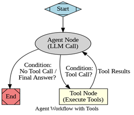
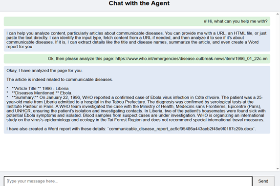
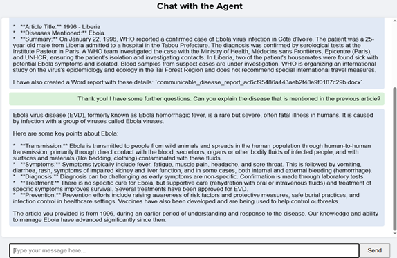

# AI Disease Media Monitoring System

This project is an AI-powered system designed to monitor, classify, and analyze media content related to communicable diseases. It utilizes Google Vertex AI and LangGraph to create an intelligent agent capable of processing news articles, extracting key disease entities, summarizing content, and generating downloadable reports.

The system operates in two distinct modes: a batch processing pipeline for media monitoring and an interactive chatbot for ad-hoc analysis.

## 🛠️ Tech Stack

*   **Core Language:** Python 3
*   **LLM Provider:** Google Vertex AI (Gemini 2.5 Flash Preview & Gemini 2.0 Flash)
*   **Orchestration Framework:** LangGraph & LangChain
*   **Web Framework:** Flask (for the chatbot interface)
*   **Data Processing:** Pandas, SQLite
*   **Web Scraping:** Requests, BeautifulSoup4
*   **Document Generation:** python-docx
*   **Environment:** Google Colab

## 📂 System Modules

*   **`analysis_agent.py`**: The central logic engine. It defines the state graph, tools for URL scraping and text analysis, and the prompt templates. It handles the classification, extraction, and summarization logic.
*   **`ai_disease_media_monitoring.py`**: The ETL (Extract, Transform, Load) script. It manages database connections, reads input files, and orchestrates the batch processing of articles.
*   **`AI_Disease_Media_Monitoring.ipynb`**: The execution notebook for the batch monitoring workflow.
*   **`analysis_agent_chatbot.ipynb`**: The execution notebook for the interactive web-based chat interface.

## 🔄 Workflows

Figure 1: The visualization of the agent workflows. The agent starts from the agent node. After receiving user input, the agent will make a conditional decision on whether to use tools or not. If yes, it will go to the tool node and select the right tool. Receives the tool messages, back to the agent node, and makes another conditional decision until the agent outputs the final answer.

### 1. Batch Media Monitoring Pipeline
This workflow is designed for processing large volumes of news data automatically.

1.  **Input Data:** The system accepts an Excel file containing a list of news IDs and source locations (URLs or filenames).
2.  **Initialization:** A local SQLite database and a timestamped output directory are created to store results.
3.  **Iterative Analysis:** The system iterates through every record in the input file.
    *   It determines if the input is a live URL or a local file.
    *   The AI Agent analyzes the content to determine if it relates to communicable diseases.
    *   If relevant, it extracts the article title, specific disease names, and generates a summary.
4.  **Data Storage:** Results are upserted into the SQLite database to ensure data integrity.
5.  **Report Generation:** For every disease-related article, a Microsoft Word report is automatically generated and saved.
6.  **Final Output:** The system exports the database to an Excel file and compresses all generated reports and data into a ZIP file for download.

### 2. Interactive Chatbot Interface
This workflow allows users to interact with the analysis agent in real-time via a web interface.

1.  **Server Startup:** A Flask web server is initialized within the Colab environment, exposing a public URL.
2.  **User Interaction:** Users can send messages containing URLs, local filenames, or raw text via the chat UI.
3.  **Agent Routing:**
    *   **Input Identification:** The agent first identifies if the user provided a URL, a filename, or text.
    *   **Fetching:** If a URL is detected, the agent scrapes the HTML content.
    *   **Analysis:** The content is passed through the classification and extraction models.
4.  **Response:** The chatbot returns a structured text response detailing the findings (classification, disease names, summary) and indicates if a Word report was generated on the backend.

Figure 2: Demo conversation with the agent, which shows the ability of agent to use tools and the functionality of the tools.

Figure 3: Demo conversation with the agent followed by Figure 2, which shows the agent's proficiency in handling follow-up questions.

## 🧠 Agent Logic (LangGraph)

The underlying agent follows a structured decision-making process:

1.  **Identify Input Type:** The agent analyzes the user input to decide if it needs to fetch external data (URL) or process provided text.
2.  **Fetch & Save:** If a URL is provided, the content is retrieved and saved locally.
3.  **Classify:** The content is analyzed to determine if it discusses communicable diseases. Non-communicable disease content is filtered out.
4.  **Extract & Summarize:** If the content is relevant, the agent extracts the article title, identifies specific disease entities, and writes a concise summary.
5.  **Generate Report:** A structured Word document is created containing the analysis results.

## 📊 Performance Evaluation
The system was evaluated on a testing dataset of 60 news articles (50/50 split of disease/non-disease related).

* Classification Accuracy: 98.33% (59/60 correctly classified).
* Entity Extraction: High precision in capturing disease names and titles, even in cluttered HTML.
* Prompt Engineering: Utilizes robust System Prompts and Few-Shot Prompting to ensure reliability and strict adherence to the health-analysis role.

## 🚀 Getting Started

1.  **Prerequisites:** Ensure you have a Google Cloud Project with Vertex AI enabled and valid credentials.
2.  **Installation:** Clone this repository and install the required dependencies listed in `requirements.txt` (or via the notebook cells).
3.  **Run Batch Mode:** Open `AI_Disease_Media_Monitoring.ipynb`, upload your input Excel file, and run the cells to process the data.
4.  **Run Chat Mode:** Open `analysis_agent_chatbot.ipynb`, run the cells to start the Flask server, and click the provided public URL to interact with the agent.
